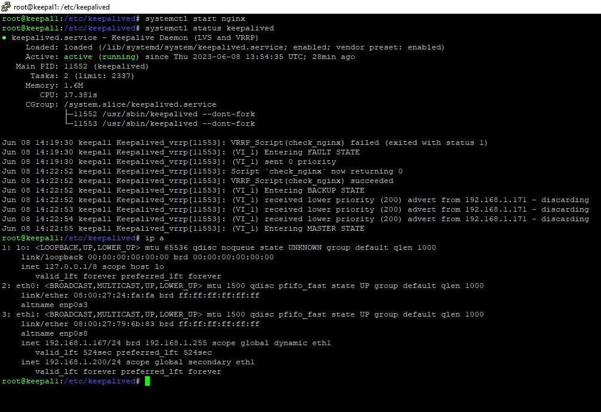

# Домашнее задание к занятию "Disaster recovery и Keepalived" - Лебедев Алексей, fops-10


---

### Задание 1  

- Дана схема для Cisco Packet Tracer, рассматриваемая в лекции.
- На данной схеме уже настроено отслеживание интерфейсов маршрутизаторов Gi0/1 (для нулевой группы)
- Необходимо аналогично настроить отслеживание состояния интерфейсов Gi0/0 (для первой группы).
- Для проверки корректности настройки, разорвите один из кабелей между одним из маршрутизаторов и Switch0 и запустите ping между PC0 и Server0.
- На проверку отправьте получившуюся схему в формате pkt и скриншот, где виден процесс настройки маршрутизатора.  

### Решение:  
  
  - Для начала, хочу заметить, что в настройке данной топологии допущена ошибка и, при подобном отключении, пакеты от ПК до сервера ходить перестают (на этом скриншоте можно видеть, что я уже дописал правильные настройки на интерфейсах маршрутизаторов:  

  
  
  - Правильная (как я считаю) конфигурация интерфейсов для обоих маршрутизаторов:  

   
  
  - Был добавлен track на интерфейсы gi0/0, был изменен приоритет на интерфейсах gi0/1 маршрутизаторов 1 и 2, также, был назначен preempt на интерфейсе gi0/1 маршрутизатора 1, чтобы он переходил в состояние master в случае обрыва нулевой группы.  

- .pkt-файл будет прикреплен.

`При необходимости прикрепитe сюда скриншоты
`


---

### Задание 2


- Запустите две виртуальные машины Linux, установите и настройте сервис Keepalived как в лекции, используя пример конфигурационного файла.
- Настройте любой веб-сервер (например, nginx или simple python server) на двух виртуальных машинах.
- Напишите Bash-скрипт, который будет проверять доступность порта данного веб-сервера и существование файла index.html в root-директории данного веб-сервера.
- Настройте Keepalived так, чтобы он запускал данный скрипт каждые 3 секунды и переносил виртуальный IP на другой сервер, если bash-скрипт завершался с кодом, отличным от нуля (то есть порт веб-сервера был недоступен или отсутствовал index.html). Используйте для этого секцию vrrp_script.
- На проверку отправьте получившейся bash-скрипт и конфигурационный файл keepalived, а также скриншот с демонстрацией переезда плавающего ip на другой сервер в случае недоступности порта или файла index.html.  

### Решение:  
  
 - Развернем несколько машин в virtualbox используя Vagrant и напишем небольшой плэйбук в Ansible, чтобы поставить nginx + keepalived (службу keepalived пока стартовать не будем, т.к. мы ее не конфигурировали и мало ли что) :  
 
```
- name: pushing nginx
  hosts: nginx
  become: true
  tasks:


  - name: installing nginx
    apt:
      name:
        - nginx
      state: present

  - name: installing keepalived
    apt:
      name:
        - keepalived
      state: present

  - name: Start a service with systemd and adding to autorun
    systemd:
      name: nginx
      state: started
      enabled: yes 
```      
    
    
- Напишем bash-скрипт, удовлетворяющий нашим условиям. Для проверки порта будем использовать curl, для проверки существования файла - **-f**.  


 ```  
 
#!/bin/bash

# Проверка доступности порта с использованием curl
curl --head --silent --fail "http://localhost:80" >/dev/null 2>&1
if [ $? -ne 0 ]; then
  exit 1
fi

# Проверка существования файла index.html
if [ ! -f "/var/www/html/index.nginx-debian.html" ]; then
  exit 1
fi

exit 0 

```
  
- Конфигурация keepalived.conf *MASTER*:  

```
vrrp_script check_nginx {
      script "/etc/keepalived/ngchk.sh"
      interval 3

}

vrrp_instance VI_1 {
        state MASTER
        interface eth1
        virtual_router_id 200
        priority 254
        advert_int 1

        virtual_ipaddress {
              192.168.1.200/24
        }
        track_script {
           check_nginx
        }
}
```  
  
 - *BACKUP*:  

```

vrrp_script check_nginx {
      script "/etc/keepalived/ngchk.sh"
      interval 3

}

vrrp_instance VI_1 {
        state BACKUP
        interface eth1
        virtual_router_id 200
        priority 200
        advert_int 1

        virtual_ipaddress {
              192.168.1.200/24
        }
        track_script {
           check_nginx
        }
}
```
  
 - Положим nginx и посмотрим статус:  

  
  
  - Поднимем nginx и проверим снова:  

 
